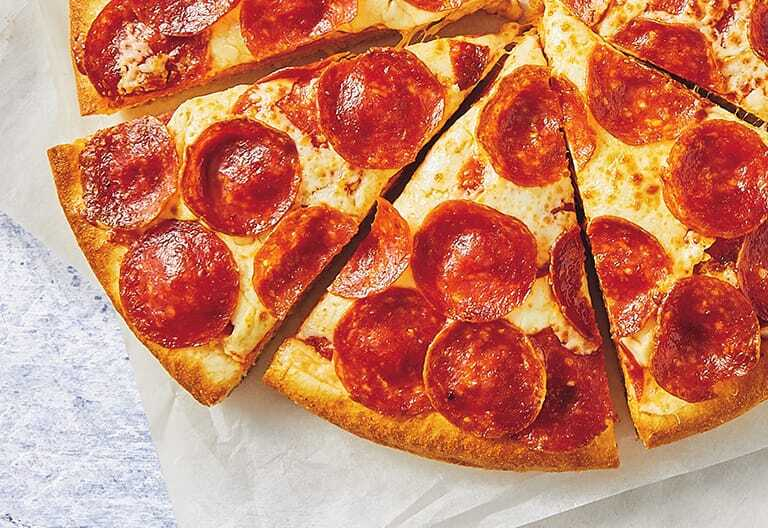

# 🍕 Pizza Hut Management System


---

## **Overview**
Pizza Hut Management System is a **web-based application** that simulates a pizza restaurant workflow. Users can browse the menu, place orders, and generate bills, while staff can manage customer interactions efficiently.

---

## **Features**
- 🍕 Browse menu items with images and descriptions.  
- 🛒 Place pizza orders through a user-friendly interface.  
- 💵 Generate and view bills for orders.  
- 📞 Contact and About pages for customer interaction.  
- ⚙️ Server-side order processing using ASP.  

---

## **Technologies Used**
- **HTML / CSS** – Front-end design and styling  
- **ASP** – Server-side scripting for order processing  
- **Microsoft Access (ACCDB)** – Database for storing orders and billing information  
- **JavaScript** – Optional interactive elements  

---

## **Project Structure**
Pizza Hut/
├── index.html # Homepage
├── menu_html.html # Pizza menu page
├── order.html # Order placement page
├── bill.html # Billing page
├── *.asp # Server-side scripts for processing orders
├── *.css # Stylesheets for pages
├── images/ # Pizza and social media images
└── Database.accdb # Access database


---

## **Screenshots**
**Homepage:**  


**Menu Page:**  


**Order Page:**  


**Bill Page:**  


---

## **Setup / How to Use**
1. Clone the repository:
   ```bash```
   git clone https://github.com/KalpanaRaja26/pizza-hut.git

2. Make sure your local server supports ASP (e.g., XAMPP or IIS).

3. Open index.html in your browser to start exploring the website.

4. Place orders and view generated bills.

Contact

For any questions or suggestions, feel free to contact me via Profile(https://kalpanaraja26.github.io/Portfolio/)
